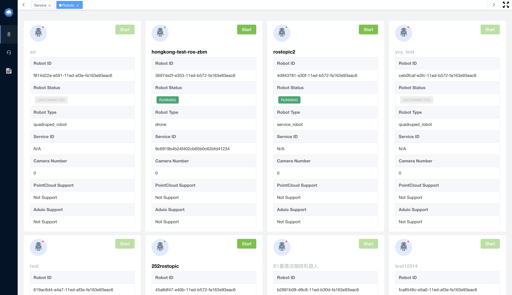

# Edge-Cloud Collaboration Teleoperation based on KubeEdge

## Introduction

This project lets you teleop a movable robot across the Internet using the WebRTC API for the Streaming / DataChannel.

The App provides:

- A WebRTC signaling server written in Python that can be used as a stand-alone server.
- A Teleoperation agent running on the robot that connects to the signaling server and streams video and data with the browser.
- A Web client developed with Vue3 that connects to the signaling server and streams video and data with the robot.

> You will find how to build and deploy them in [here](./scripts) .

## Architecture

## API Documentation

- [English](./docs/apis/en/README.md)
- [中文](./docs/apis/cn/README.md)

## Screenshots

## Installation and Startup

See the guides in [scripts](./scripts) folders.

## Contribute

Please read the [Code of Conduct](./CODE_OF_CONDUCT.md).

## License

Copyright 2021 The KubeEdge Authors. All rights reserved.

Licensed under the [Apache License](./LICENSE), Version 2.0.