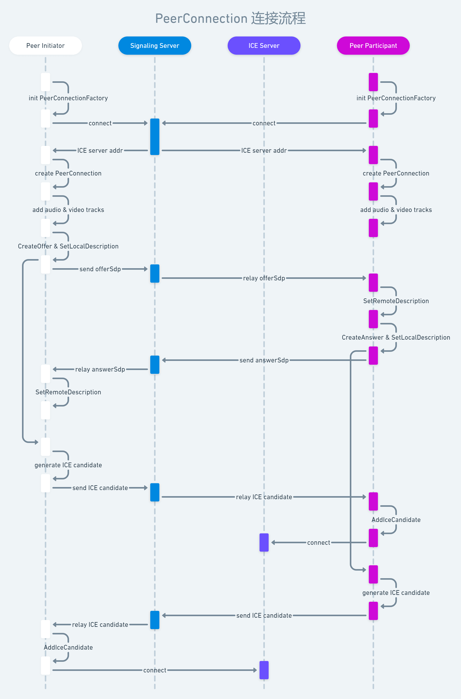

## Teleop Client

### 1. Overview

The client refers to the js client used for remote operation of the robot. 
This document consist of the design of the client interface, including client access, client interface, client data flow, etc.

### 2. client access

The client performs service management with the server through the restful(http) interface, communication with the server through websocket, and performs media communication with the robot through WebRTC.

### 3. client interface

The WebRTC protocol stack mainly includes the following parts:

- Standard protocol stack, mainly including TCP protocol stack recommended for signaling interaction and UDP protocol stack for media data transmission.
- WebRTC C++ implementation and C++ Native API, which can be used by developers directly on the client App.
- The standard JavaScript API is mainly used for direct use by the browser.


### 4. Data over WebRTC

```yaml
v=0
o=jdoe 2890844526 2890842807 IN IP4 10.47.16.5
s=SDP Seminar
i=A Seminar on the session description protocol
u=http://www.example.com/seminars/sdp.pdf
e=j.doe@example.com (Jane Doe)
c=IN IP4 224.2.17.12/127
t=2873397496 2873404696
a=recvonly
m=audio 49170 RTP/AVP 0
m=video 51372 RTP/AVP 99
a=rtpmap:99 h263-1998/90000
```



#### 4.1 Video/Audio (Streaming)

TBA

#### 4.2 Interactive data (dataChannel)

##### 4.2.1 from Robot

- Robot Status

```json

{
    "type": "robotStatus",
    "status": {
        "battery": 0,
        "isCharging": false,
        "batteryVoltage": 0,
        "batteryCurrent": 0,
        "batteryLevel": 0,
        "cpuUsage": 0,
        "memUsage": 0,
        "wifiNetwork": "",
        "wifiStrength": "",
        "localIp": "",
        "diskUsage": 0
    }
}
```

##### 4.2.2 from Client

- Skill Action Execute

```json

{
  "type": "action",
  "cmd": "skill",
  "action": "pickup"
}

```

- Force Stop

```json

{
  "type": "stop"
}

```

- Move

```json

{
  "type": "velCmd",
  "x": 0, // 线速度
  "yaw": 0 // 角速度
}
```
