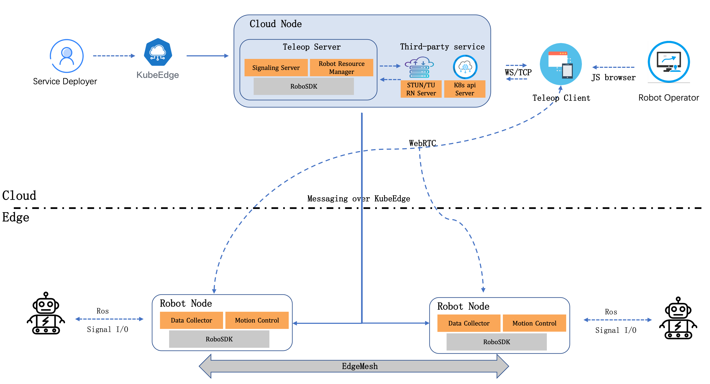

## Teleop Server

This document consist of a WebRTC-based teleoperation service gateway for movable robots. 
Serving externally in the form of microservices, the service gateway can connect clients and remote robots.
The client can perform authentication, robot management, session management, etc. through the service gateway.
This document will discuss in detail scenario analysis, system architecture design, interface design and service deployment scheme, as well as the API design of services.

### 0. Overview

In order to realize the communication between the WebRTC service gateway, the client and the remote robot, we need to design some interfaces to transmit signaling, media and control information.

#### To Client

- **Room Management**: Clients can join or leave a room by sending `join`, `leave` and other messages. A room refers to a group of clients and robots that make audio and video calls. The WebRTC service gateway will return corresponding response messages, such as joined, left, etc., as well as information about other members in the room.
- **Media negotiation**: The client can conduct media negotiation by sending `offer`, `answer`, `candidate` and other messages, that is, exchanging SDP (Session Description Protocol) and ICE (Interactive Connectivity Establishment) information, and establishing audio video connection. The WebRTC service gateway will forward these messages to the corresponding target client or robot.
- **Control command**: The client can operate the remote robot by sending some control commands, such as moving, rotating, grabbing, etc. These instructions are defined by specific business scenarios, and the WebRTC service gateway will forward these instructions to the corresponding robots.
- **Status Feedback**: The WebRTC service gateway can send some status feedback information to the client to report its current status, such as location, speed, power, etc. These status feedback information are defined by specific business scenarios, and the client can display this information to users or use it for monitoring and analysis.
- **Event information**: The WebRTC service gateway can send some event information to the client to report its current status, such as the robot joining the room, leaving the room, sending media streams, etc. These event information are defined by specific business scenarios, and the client can display this information to users or use it for monitoring and analysis.
- **Signaling information**: The WebRTC service gateway can send some signaling information to the client to control its behavior, such as joining a room, leaving a room, sending media streams, etc. These signaling information are defined by specific business scenarios, and the client can display this information to users or use it for monitoring and analysis.
- **System message**: The WebRTC service gateway can send some business messages to the client to report its current status, such as the robot joining the room, leaving the room, sending media streams, etc. These business messages are defined by specific business scenarios, and the client can display this information to users or use it for monitoring and analysis.

#### To Robot

- **Media stream**: WebRTC service gateway can send or receive audio and video streams to remote robots. Audio and video streams are packets encapsulated by RTP (Real-time Transport Protocol), including audio and video data and metadata. Audio and video streams can be used for real-time monitoring or playback.
- **Control command**: The WebRTC service gateway can send some control commands to the remote robot to operate it, such as moving, rotating, grabbing, etc. These instructions are defined by specific business scenarios, and the remote robot will perform corresponding actions according to the received instructions.
- **Status Feedback**: The remote robot can send some status feedback information to the WebRTC service gateway to report its current status, such as position, speed, power, etc. These status feedback information are defined by specific business scenarios, and the WebRTC service gateway can display this information to the client or use it for monitoring and analysis.
- **Signaling information**: The WebRTC service gateway can send some signaling information to the remote robot to control its behavior, such as joining the room, leaving the room, sending media streams, etc. These signaling information are defined by specific business scenarios, and the remote robot will perform corresponding actions according to the received signaling information.
- **Configuration information**: The remote robot can send some configuration information to the WebRTC service gateway, such as preset skills, robot model, etc.
- 
### 1. System Architecture

As the core of the teleoperation service, the service gateway needs to provide an interface of the Websocket protocol for the client to call, and at the same time, it needs to communicate with the remote robot.

### 2. 关键组件

- **Websocket Server**: The service gateway provides an interface of the Websocket protocol for the client to call, and at the same time needs to communicate with the remote robot.
- **Redis**: The service gateway needs to use Redis as a cache service to store some temporary data, such as room information, robot information, etc.
- **Signaling Server**: The service gateway needs to use the signaling server to provide signaling services for the client and the remote robot.
- **STUN/TURN Server**: The service gateway needs to use the STUN/TURN server to provide NAT traversal services for the client and the remote robot.

### 3. API

The interfaces provided by the service gateway are divided into two categories: service management interface (Restful) and control interface (Websocket). 
By using these two types of interfaces together, the client can fully use all the functions of the service gateway, including authentication, robot management, session management, etc.

#### 3.1 Service Management

##### 3.1.1 Overview

- Server URL: http(s)://{teleop-server-endpoint}:{teleop-server-port}/v1/service

| Object  | APIType            | Information                                                                          |
|---------|--------------------|--------------------------------------------------------------------------------------|
| service | service management | Service management interface, CRUD.                                                  |
 | robot   | robot management   | Robot management interface, used for robot information query, Agent deployment, etc. |
| room    | room management    | Room management interface, CRUD.                                                     |

##### 3.1.2 Detail

See [Teleop-Server-API](./teleop-server-api.md)

#### 3.2 Control

##### 3.2.1 Overview

- Server URL: ws(s)://{teleop-server-endpoint}:{teleop-server-port}/{service_id}

##### 3.2.2 Detail

See [Teleop-Server-API](./teleop-server-api.md)

### 4. Deployment

TBA