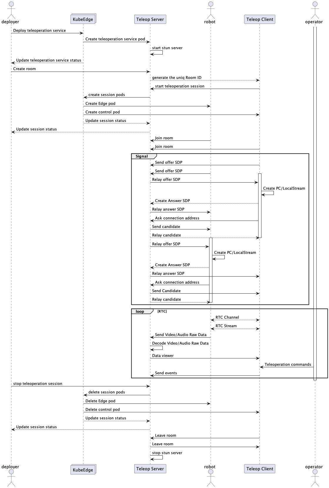

# Edge-Cloud Collaboration Teleoperation based on KubeEdge

This project aims to describe a solution about teleoperation over [KubeEdge]. As a remote control technology for controlling the robots, this application provides a universal and easy-to-use solution for moveable robots, so that he robot-operators will easily to control robot online. 

This proposal will explains the technical solution, including [Motivation](#motivation), [Use Cases](#use-cases), [Architecture](#architecture), [Design Details](#design-details) and [Future works](#future).

## Motivation

### Scenarios

The teleoperation of moveable robots refers to the remote control and monitoring of the status of moveable robots through a public network, enabling functions such as **task assignment**, **navigation**, and **collaboration**. There are many application scenarios, such as:

- **Manufacturing industry**: teleoperation can be used to handle tasks such as `material handling`, `inspection`, and `maintenance within factories`, improving production efficiency and safety.

- **Healthcare**: teleoperation can be used to provide `remote diagnosis`, `treatment`, and `care services`, alleviating the shortage of medical resources and geographical imbalances.

- **Smart city**: teleoperation can be used to enable functions such as `city management`, `environmental monitoring`, and `public services`, enhancing the level of urban intelligence.

### Challenges

Teleoperation of robots also faces some challenges and issues, such as:

- **Network latency**: due to delays and jitter in network transmission, the real-time and stability of remote operation may be affected, leading to control failure or misoperation.
- **Data security**: the risk of data leakage or tampering during network transmission may threaten the reliability and security of remote operation, resulting in data loss or malicious use.
- **User experience**: data compression or packet loss during network transmission may affect the quality and effectiveness of remote operation, leading to blurred images or stuttering.

To address these challenges and issues, we propose using `WebRTC` service gateway as the solution for teleoperation. `WebRTC` is an open-source technology that supports real-time audio and video communication between browsers.

### Goals

- Utilize highly available commercial cloud services (such as RTC, RTSP, OBS, VPN, etc.) to provide a reliability rate of over 98%, ensuring stable and low-latency remote operation in complex and dynamic environments.

- Leverage KubeEdge and container technology to shield robot device heterogeneity issues and meet scalability requirements for solution replication.

- Support bi-directional audio interaction through RTC technology to enhance the conversational capabilities of remote operation.

- Use the message channel over KubeEdge to dynamically load the skills for the robot from cloud.

- Offload resource-intensive tasks such as audio and video decoding to the cloud to reduce the load on the robot itself.

- Use H.264 standards for video encoding and decoding and adopt streaming media transmission to address the challenge of slow transmission caused by large video data volumes.

## Use Cases

- Cloud service provider

  - Enable robot solution providers to quickly implement remote control of robots by providing out-of-the-box teleoperation solutions.

  - Empower robots to offload computing power and reduce operating costs by leveraging cloud manufacturer's expertise in robot scenarios and attracting other businesses to the industry.

- Robotics Solution Provider

  - Provide one-click deployment and start-stop teleoperation services through the cloud service platform, enabling easy and quick implementation of remote control for robots.

  - Enable one-click updates of robot subscription skills through the cloud service platform, allowing for seamless integration of new features and capabilities.

  - Ensure compatibility with multi-camera vision solutions and cloud-native architecture to support various heterogeneous robots.

- Robot Operator

  - Control robot movements anytime, anywhere using teleoperation services, including movement and executing subscribed skills.

  - Real-time monitor of robot status information, such as battery level and network signal strength.

  - Adjust robot movement speed using the teleoperation service to ensure precision and safety.

  - Access multi-view audio and video through the remote operation service, and issue voice broadcasts using broadcasting equipment.

  - Switch between audio and video presentations through the remote operation service for a better remote control experience.

## Architecture

The architecture of the edge-cloud collaborative teleoperation system based on KubeEdge includes `Edge(robot) nodes`, `Cloud nodes`, and an edge-cloud collaborative controller. The edge nodes are responsible for collecting, processing, and storing sensor data, as well as providing remote teleoperation services. The cloud nodes are responsible for storing and analyzing data, and providing the teleoperation control console. The edge-cloud collaborative controller is responsible for managing and coordinating communication, computation, and storage resources between edge and cloud.

This system architecture consists of the following components:

- **Teleop-Client**: The client can be a browser, mobile device, or other terminal that supports the WebRTC protocol. In this solution, it is developed based on Astro and uses the WebSocket protocol to exchange signals with the signaling server and the UDP protocol to transmit audio and video streams with the WebRTC service gateway.

- **Signaling-Server**: The signaling server is responsible for handling signaling information such as session establishment, media negotiation, and control instructions between clients. It uses the Session Description Protocol (SDP) and Interactive Connectivity Establishment (ICE) protocol to describe and establish audio and video connections.

- **Teleop-Server**: The Teleop-Server is responsible for authentication, robot management, session management, component creation, and other services.

- **Teleop-Robot**: The Teleop-Robot is a special type of client that has the ability to capture audio and video, as well as execute movement control instructions. It uses UDP to transmit audio and video streams with the Teleop-Server and to receive and execute control instructions.

- **Turn-Server**: The STUN/TURN server helps clients and the WebRTC service gateway to achieve NAT traversal, that is, to obtain a public IP address and establish a connection in different network environments. The STUN server is used to obtain the public IP address, and the TURN server is used to relay data in cases where direct connections are not possible.

## Design Details

### Prerequisites

- [KubeEdge] v1.10+ along with **[EdgeMesh]** running
- At least one camera that can be used to capture data should be available on the robot.
- At least 1U2G of computing power on robot Node.
- At least 4U8G of computing power on Cloud Node.

### Run View

### Performance

In this case, we conducted sets of experiments, each of which included real-time video streaming in both LAN and WAN modes. In the experiments, we measured the resource consumption of the server and robot and latency.

#### Resource Consumption Comparison

In the first set of experiments, we used the [AgileX robot](https://www.agilex.ai/product/3?lang=en) as an example to test the resource consumption under different network conditions. We used two different network conditions, namely LAN and WAN (5G). The experimental results are as follows:

| Network Condition | Resource Consumption in SFU Mode (CPU Usage) | Resource Consumption in P2P Mode (CPU Usage) |
|:-----------------:|:----------------------------------------------------:|:----------------------------------------------------:|
|      LAN           |                        4.5%                            |                         16.3%                           |
|      WAN           |                        5.2%                            |                         17.8%                           |

#### Latency Comparison

In the second set of experiments, we tested the end-to-end latency under different network conditions using a single robot as an example. We also used two different network conditions, namely LAN and WAN (5G). The experimental results are as follows:

| Network Condition | Latency in SFU Mode (ms) | Latency in P2P Mode (ms) |
|:-----------------:|:---------------------------------:|:----------------------------------:|
|      LAN           |               122                  |                  70                |
|      WAN           |               740                  |                 522                |

- When tested on the WAN, with the robot body and server located in different regions, the end-to-end latency in P2P mode was about 522 ms.

- When tested on the LAN, with the robot body and server located in the same region, the end-to-end latency in P2P mode was about 70 ms.

## Future

In order to improve the performance and stability of the WebRTC service gateway, we need to optimize the server, including the following aspects:

- **Network optimization**: choose the appropriate network protocol and transmission method, choose UDP or TCP according to different scenarios, and use encryption protocols such as SRTP or SRTCP to ensure data security. We also need to use the STUN/TURN server to implement NAT traversal and data transfer, and use the ICE framework to select the best network path.
- **CPU optimization**: allocate the CPU resources reasonably to avoid excessive thread switching and lock competition. We can adopt a multi-thread optimization solution to separate I/O operations and business logic processing into different threads, and try to allow users in the same room to process in the same thread. We can also use the Traffic Control framework provided by the Linux kernel to simulate different network environments and test the performance of the server under weak network conditions.
- **Memory optimization**: manage the memory resources reasonably to avoid memory leaks and fragmentation. We can use technologies such as smart pointers to automatically reclaim useless memory space, and technologies such as memory pools to reduce the overhead of memory allocation and release. We can also use the huge page3 function provided by Linux to reduce the performance loss caused by the lack of TLB (Translation Lookaside Buffer).
- **Bandwidth optimization**: use bandwidth resources reasonably to avoid bandwidth waste and congestion. We can dynamically adjust the bit rate, resolution, frame rate and other parameters of audio and video streams according to the needs of different users and network conditions. We can also use SFU or MCU model 1 to implement functions such as mixing, transcoding, and distribution of multiple audio and video streams, reducing uplink and downlink bandwidth consumption.

[KubeEdge]: https://github.com/kubeedge/kubeedge
[edgemesh]: https://github.com/kubeedge/edgemesh